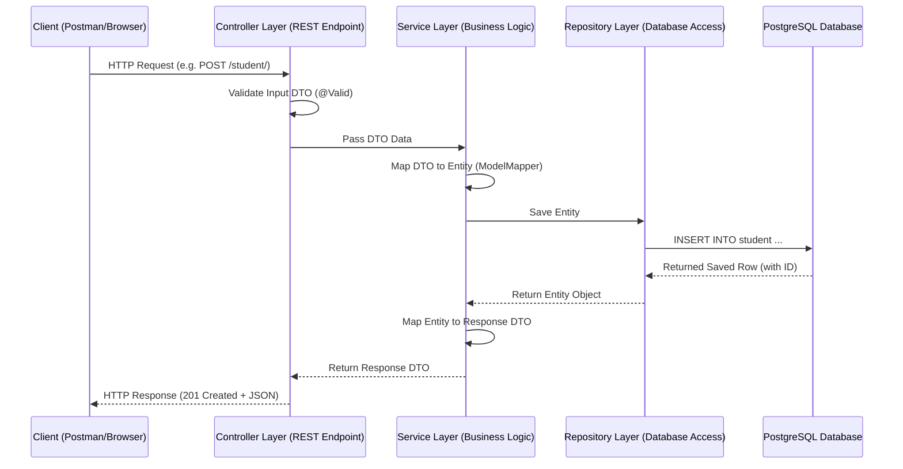

# 📝 Spring Boot Learning Notes: Student API

This document serves as your personal learning manual. It is structured around the code you've written in this repository, explaining the concepts behind each file, how they interact, and how to extend them.

---

## 🏗️ 1. Architecture of a Spring Boot Application

Spring Boot applications follow a **Layered Architecture**. This separates concerns so that database code, business logic, and web endpoints do not interfere with each other.



---

## 📂 2. Tour of Your Codebase (Component Breakdown)

Let's look at each layer of the application that you've implemented:

### A. Configuration Layer
*   **File:** [MapperConfig.java](file:///Users/tanishsingh/Desktop/student-api/src/main/java/com/tanish/student_api/config/MapperConfig.java)
*   **Concepts:**
    *   **`@Configuration`:** Tells Spring that this class contains methods annotated with `@Bean`. Spring will compile these method outputs into beans managed by the IoC container.
    *   **`@Bean`:** Defines a third-party class instance (in this case, `ModelMapper`) as a Spring Bean so it can be autowired/injected into your service classes.
    *   **Why use ModelMapper?** It saves you from writing boring mapping code (e.g., `student.setName(dto.getName())`).

---

### B. Entity Layer (Database Model)
*   **File:** [Student.java](file:///Users/tanishsingh/Desktop/student-api/src/main/java/com/tanish/student_api/entity/Student.java)
*   **Concepts:**
    *   **`@Entity`:** Tells Jakarta Persistence (JPA) that this class represents a table in the database.
    *   **`@Id` and `@GeneratedValue`:** Identifies the primary key and configures it to auto-increment.
    *   **Lombok Annotations (`@Getter`, `@Setter`, `@ToString`):** Generates boilerplate getters, setters, and string representation methods at compile time.

---

### C. Repository Layer (Database Operations)
*   **File:** [StudentRepository.java](file:///Users/tanishsingh/Desktop/student-api/src/main/java/com/tanish/student_api/repository/StudentRepository.java)
*   **Concepts:**
    *   **`extends JpaRepository<Student, Long>`:** Inherits dozens of database methods like `save()`, `findById()`, `findAll()`, `deleteById()`, and `existsById()` out-of-the-box.
    *   **`@Repository`:** Marks this as a repository component and enables automatic database-exception translation.

---

### D. Service Layer (Business Logic)
*   **Files:**
    *   Interface: [StudentService.java](file:///Users/tanishsingh/Desktop/student-api/src/main/java/com/tanish/student_api/service/StudentService.java)
    *   Implementation: [StudentServiceimple.java](file:///Users/tanishsingh/Desktop/student-api/src/main/java/com/tanish/student_api/service/impl/StudentServiceimple.java)
*   **Concepts:**
    *   **`@Service`:** Marks this class as a Service Bean containing the application's business rules.
    *   **`@RequiredArgsConstructor`:** Generates a constructor injecting `ModelMapper` and `StudentRepository` automatically.
    *   **DTO Mapping:** In `getAllStudents()`, you use standard streams to convert entity lists into DTO lists:
        ```java
        students.stream()
                .map(student -> new StudentDto(student.getId(), student.getName(), student.getEmail()))
                .toList();
        ```

---

### E. Controller Layer (REST Endpoints)
*   **File:** [StudentController.java](file:///Users/tanishsingh/Desktop/student-api/src/main/java/com/tanish/student_api/controller/StudentController.java)
*   **Concepts:**
    *   **`@RestController`:** Handles HTTP requests and serializes output directly to JSON.
    *   **`@RequestMapping("/student")`:** Prepends `/student` to all endpoints inside this class.
    *   **HTTP Request Mappings:**
        *   `@GetMapping("/")`: Retrieves all students.
        *   `@GetMapping("/{id}")`: Retrieves one student by ID. Uses `@PathVariable` to read the `{id}`.
        *   `@PostMapping("/")`: Creates a new student. Uses `@RequestBody` and `@Valid` to read and validate incoming data.
        *   `@PutMapping("/{id}")`: Performs a complete update of a student.
        *   `@PatchMapping("/{id}")`: Performs a partial update (e.g. updating just the email) using a `Map<String, Objects>`.
        *   `@DeleteMapping("/{id}")`: Deletes a student.

---

### F. DTOs & Validation
*   **Files:**
    *   [StudentDto.java](file:///Users/tanishsingh/Desktop/student-api/src/main/java/com/tanish/student_api/Dto/StudentDto.java)
    *   [Addstudentrequestdto.java](file:///Users/tanishsingh/Desktop/student-api/src/main/java/com/tanish/student_api/Dto/Addstudentrequestdto.java)
*   **Concepts:**
    *   **DTO (Data Transfer Object):** Keeps database entities decoupled from client request/response structures. You don't want the client to send database internal columns (like IDs or passwords) in requests.
    *   **Validation Annotations:**
        *   `@NotBlank(message = "...")` checks that name is not empty or whitespace.
        *   `@Size(min = 3, max = 10)` limits character length.
        *   `@Email` enforces proper structure (e.g., name@domain.com).

---

## ⚡ 3. The Request-Response Lifecycle Walkthrough

Here is exactly what happens when you run a `POST` request to register a student:

1.  **Incoming Request:** Client sends a HTTP POST to `http://localhost:8080/api/student/` with body:
    ```json
    {
      "name": "Raj",
      "email": "raj@gmail.com"
    }
    ```
2.  **Routing & Context:**
    *   Spring Boot routes request to `/api` context path based on [application.properties](file:///Users/tanishsingh/Desktop/student-api/src/main/resources/application.properties#L13).
    *   Spring MVC's **DispatcherServlet** maps it to the `createNewStudent` method in [StudentController.java](file:///Users/tanishsingh/Desktop/student-api/src/main/java/com/tanish/student_api/controller/StudentController.java#L50).
3.  **Validation Check:**
    *   Spring sees `@Valid` on `Addstudentrequestdto`.
    *   Since `"Raj"` is $3$ characters long, it passes `@Size(min = 3, max = 10)`.
    *   Since `"raj@gmail.com"` is a valid format, email passes `@Email`.
4.  **Service Invocation:**
    *   Controller calls `studentService.createNewStudent(addstudentrequestdto)`.
5.  **Data Mapping & Save:**
    *   In [StudentServiceimple.java](file:///Users/tanishsingh/Desktop/student-api/src/main/java/com/tanish/student_api/service/impl/StudentServiceimple.java#L40), ModelMapper converts `Addstudentrequestdto` into a `Student` entity.
    *   `studentRepository.save(newstudent)` executes a SQL query `INSERT INTO student ...` in PostgreSQL database.
    *   The database returns the student object with its generated ID (e.g., `1`).
6.  **Response Construction:**
    *   The saved entity is mapped back to `StudentDto` using ModelMapper.
    *   The controller wraps it inside `ResponseEntity.status(HttpStatus.CREATED)` (HTTP Status 201) and returns it.

---

## 🛠️ 4. How to Run and Test This API

### Prerequisites
Make sure your PostgreSQL database is running on port 5432, with the database `postgres`, username `postgres`, and password `Tanish#2005` (according to your [application.properties](file:///Users/tanishsingh/Desktop/student-api/src/main/resources/application.properties)).

### Running the application
To start the application, navigate to the root directory and run:
```bash
./mvnw spring-boot:run
```

### Testing Endpoints

#### 1. Create a Student (POST)
```bash
curl -X POST http://localhost:8080/api/student/ \
     -H "Content-Type: application/json" \
     -d '{"name": "Utkarsh", "email": "utkarsh@gmail.com"}'
```

#### 2. Get All Students (GET)
```bash
curl -X GET http://localhost:8080/api/student/
```

#### 3. Get Student by ID (GET)
```bash
curl -X GET http://localhost:8080/api/student/1
```

#### 4. Delete Student (DELETE)
```bash
curl -X DELETE http://localhost:8080/api/student/1
```
