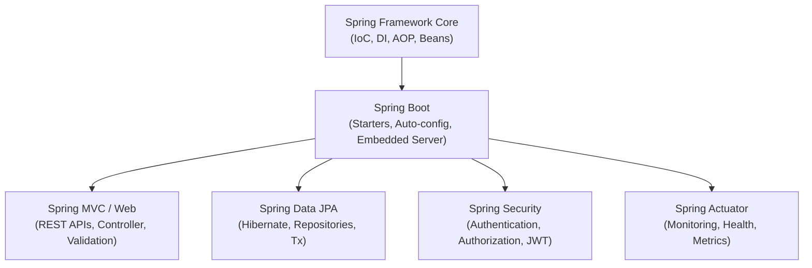

# Spring Boot Interview Questions & Answers Guide

Welcome! This is a comprehensive, production-ready interview preparation guide covering the Spring Framework, Spring Boot, Spring Data JPA, REST APIs, and related ecosystem topics. Use this to prepare for interviews ranging from Associate Software Engineer to Senior backend developer.

---

## 🗺️ Spring Ecosystem Overview



---

## 📚 Table of Contents
1. [Core Spring Framework & Dependency Injection](#1-core-spring-framework--dependency-injection)
2. [Spring Boot Foundations](#2-spring-boot-foundations)
3. [Spring MVC & REST API Design](#3-spring-mvc--rest-api-design)
4. [Data Access with JPA & Hibernate](#4-data-access-with-jpa--hibernate)
5. [Advanced Spring Boot (Security, Actuator, Testing)](#5-advanced-spring-boot-security-actuator-testing)

---

## 1. Core Spring Framework & Dependency Injection

### Q1: What is Dependency Injection (DI) and how does it relate to Inversion of Control (IoC)?
**Answer:**
*   **Inversion of Control (IoC):** This is a general design principle where the control of object creation, configuration, and lifecycle is transferred (inverted) from the program code to a container or framework. Instead of your class manually instantiating its dependencies using the `new` keyword, the framework takes care of it.
*   **Dependency Injection (DI):** This is the specific *design pattern* used to implement IoC. It is the process of supplying an external dependency (object) to a class.
*   **In your Student API:** 
    In [StudentController.java](file:///Users/tanishsingh/Desktop/student-api/src/main/java/com/tanish/student_api/controller/StudentController.java), the controller doesn't write `this.studentService = new StudentServiceimple()`. Instead, it declares a `private final StudentService studentService;` dependency, and Spring automatically *injects* the bean at runtime.

---

### Q2: What are the different types of Dependency Injection in Spring? Which is recommended?
**Answer:**
Spring supports three primary ways to inject dependencies:

1.  **Constructor Injection (Recommended):**
    ```java
    private final StudentService studentService;
    
    public StudentController(StudentService studentService) {
        this.studentService = studentService;
    }
    ```
    *   *Why recommended:* Enforces **immutability** (dependencies can be declared `final`), guarantees that the class is never instantiated in an uninitialized state, and makes unit testing easier (dependencies can be passed easily in tests).
    *   *Note:* With Lombok's `@RequiredArgsConstructor` (as used in your controller), you don't even have to write this boilerplate code; it generates constructor injection automatically for all `final` fields.

2.  **Setter Injection:**
    ```java
    private StudentService studentService;
    
    @Autowired
    public void setStudentService(StudentService studentService) {
        this.studentService = studentService;
    }
    ```
    *   *When to use:* Best for optional dependencies that can be changed or injected later.

3.  **Field Injection:**
    ```java
    @Autowired
    private StudentService studentService;
    ```
    *   *Why discouraged:* It hides dependencies, makes unit testing harder (requires reflection or Spring container to inject mocks), and doesn't allow dependencies to be `final`.

---

### Q3: Explain Spring Beans, Bean Scopes, and their default scope.
**Answer:**
A **Spring Bean** is simply an object that is instantiated, assembled, and managed by the Spring IoC container. 

Spring supports 6 scopes, out of which 4 are web-aware:
1.  **singleton (Default):** Only one instance of the bean is created per Spring IoC container. Every request for that bean returns the same instance. It is stateless.
2.  **prototype:** A new bean instance is created *every time* it is requested from the container. Used for stateful beans.
3.  **request (Web-aware):** A single bean instance is created per HTTP request lifecycle.
4.  **session (Web-aware):** A single bean instance is created per HTTP session.
5.  **application (Web-aware):** Scoped to the lifecycle of a `ServletContext`.
6.  **websocket (Web-aware):** Scoped to a `WebSocket` lifecycle.

---

### Q4: What is the Spring Bean Lifecycle?
**Answer:**
The bean lifecycle consists of the following phases:
1.  **Instantiation:** Spring instantiates the bean (calls constructor).
2.  **Populate Properties:** Dependency Injection takes place.
3.  **Aware Interfaces:** If the bean implements interfaces like `BeanNameAware` or `ApplicationContextAware`, Spring passes corresponding references.
4.  **Pre-Initialization:** `BeanPostProcessor.postProcessBeforeInitialization()` runs.
5.  **Initialization:** 
    *   Methods annotated with `@PostConstruct` execute.
    *   `afterPropertiesSet()` (from `InitializingBean` interface) executes.
    *   Custom `init-method` declared in bean definition executes.
6.  **Post-Initialization:** `BeanPostProcessor.postProcessAfterInitialization()` runs. Bean is ready for use.
7.  **Destruction:**
    *   Methods annotated with `@PreDestroy` execute.
    *   `destroy()` (from `DisposableBean` interface) executes.
    *   Custom `destroy-method` executes.

---

## 2. Spring Boot Foundations

### Q5: What is Spring Boot and how is it different from Spring Framework?
**Answer:**

| Feature | Spring Framework | Spring Boot |
| :--- | :--- | :--- |
| **Focus** | Provides dependency injection, MVC, and core enterprise Java abstractions. | Simplifies developer experience, packaging, and configuration of Spring apps. |
| **Configuration** | Requires extensive configuration (XML or Java Config classes). | Prefers **Auto-configuration** (Convention over Configuration). |
| **Server** | Needs to be deployed to an external Servlet container (Tomcat, Wildfly). | Comes with an **embedded server** (Tomcat/Jetty) inside a runnable JAR. |
| **Dependencies** | Requires manual dependency version synchronization. | Uses **Starter POMs** to group related dependencies with pre-tested versions. |
| **Production Ready** | Requires external configuration for health check and metrics. | Provides **Spring Boot Actuator** out-of-the-box for production monitoring. |

---

### Q6: What is `@SpringBootApplication` and what does it combine?
**Answer:**
`@SpringBootApplication` is placed on the main entrypoint class (e.g., [StudentApiApplication.java](file:///Users/tanishsingh/Desktop/student-api/src/main/java/com/tanish/student_api/StudentApiApplication.java)). It is a bootstrap annotation that combines three key annotations:

1.  **`@SpringBootConfiguration`:** A specialized form of `@Configuration`. Marks the class as a source of bean definitions.
2.  **`@EnableAutoConfiguration`:** Directs Spring Boot to automatically configure beans based on dependencies present in the classpath (e.g., configuring `DataSource` because a PostgreSQL driver is present).
3.  **`@ComponentScan`:** Configures component scanning, instructing Spring to scan the current package and all its subpackages for components (`@Component`, `@Service`, `@Repository`, `@RestController`, `@Configuration`).

---

### Q7: How does Spring Boot's Auto-configuration work?
**Answer:**
Auto-configuration operates using conditional annotations. During application startup:
1.  Spring Boot scans the classpath for classes and libraries.
2.  It looks at files like `META-INF/spring.factories` or auto-configure registration files containing lists of auto-configuration classes.
3.  It evaluates conditional annotations on these classes, such as:
    *   `@ConditionalOnClass`: Configures a bean only if a certain class is present (e.g. Hibernate classes).
    *   `@ConditionalOnMissingBean`: Configures a default bean only if the developer has *not* defined their own custom bean.
    *   `@ConditionalOnProperty`: Configures a bean based on settings in `application.properties`.

For instance, your [MapperConfig.java](file:///Users/tanishsingh/Desktop/student-api/src/main/java/com/tanish/student_api/config/MapperConfig.java) defines a `ModelMapper` bean. If ModelMapper had an auto-configuration class, it would check if you defined your own bean first before creating one automatically.

---

## 3. Spring MVC & REST API Design

### Q8: What is the difference between `@Controller` and `@RestController`?
**Answer:**
*   **`@Controller`:** Marks a class as a Spring Web MVC controller. Methods usually return a `String` representing a template name (HTML/JSP view). If a method needs to return raw data, it must be explicitly annotated with `@ResponseBody`.
*   **`@RestController`:** A specialized convenience annotation that combines `@Controller` and `@ResponseBody`. Every single method automatically writes its return value directly into the HTTP response body as JSON/XML. It is the default for building REST APIs.
*   **In your code:** [StudentController.java](file:///Users/tanishsingh/Desktop/student-api/src/main/java/com/tanish/student_api/controller/StudentController.java) uses `@RestController` because it serves client data (DTOs) rather than UI web pages.

---

### Q9: Explain `@PathVariable` vs `@RequestParam` with examples.
**Answer:**
*   **`@PathVariable`:** Used to extract values directly from the URI path. Good for identifying a resource.
    *   *URL Structure:* `/api/student/5`
    *   *Implementation:*
        ```java
        @GetMapping("/{id}")
        public ResponseEntity<StudentDto> getStudentById(@PathVariable Long id) { ... }
        ```
*   **`@RequestParam`:** Used to extract query parameters from the request URL. Good for filtering, sorting, or pagination.
    *   *URL Structure:* `/api/student?age=20&sortBy=name`
    *   *Implementation:*
        ```java
        @GetMapping
        public List<StudentDto> getStudents(@RequestParam(value = "age", defaultValue = "18") int age) { ... }
        ```

---

### Q10: What is the purpose of `@Valid` and how do validation annotations work?
**Answer:**
`@Valid` (from `jakarta.validation` API) triggers validation checks on incoming request objects before method execution starts.
*   **How it works:** When a client sends a request body, Spring deserializes the JSON into a DTO (e.g., [Addstudentrequestdto.java](file:///Users/tanishsingh/Desktop/student-api/src/main/java/com/tanish/student_api/Dto/Addstudentrequestdto.java)). By marking the parameter with `@Valid` in [StudentController.java](file:///Users/tanishsingh/Desktop/student-api/src/main/java/com/tanish/student_api/controller/StudentController.java):
    ```java
    public ResponseEntity<StudentDto> createNewStudent(@RequestBody @Valid Addstudentrequestdto dto)
    ```
    Spring executes validations declared on the fields:
    *   `@NotBlank`: Rejects empty or whitespace-only strings.
    *   `@Size(min = 3, max = 10)`: Rejects names with length less than 3 or more than 10.
    *   `@Email`: Validates correct email format.
*   If validation fails, Spring throws `MethodArgumentNotValidException` and blocks request processing, returning an HTTP `400 Bad Request` default response.

---

### Q11: How do you handle exceptions globally in Spring Boot?
**Answer:**
You handle exceptions globally using `@ControllerAdvice` or `@RestControllerAdvice` along with `@ExceptionHandler` methods.

**Example Implementation (Global Exception Handler):**
```java
@RestControllerAdvice
public class GlobalExceptionHandler {

    @ExceptionHandler(IllegalArgumentException.class)
    public ResponseEntity<Map<String, Object>> handleIllegalArgument(IllegalArgumentException ex) {
        Map<String, Object> body = new HashMap<>();
        body.put("timestamp", LocalDateTime.now());
        body.put("message", ex.getMessage());
        body.put("status", HttpStatus.BAD_REQUEST.value());
        
        return new ResponseEntity<>(body, HttpStatus.BAD_REQUEST);
    }
    
    @ExceptionHandler(MethodArgumentNotValidException.class)
    public ResponseEntity<Map<String, String>> handleValidationExceptions(MethodArgumentNotValidException ex) {
        Map<String, String> errors = new HashMap<>();
        ex.getBindingResult().getFieldErrors().forEach(error -> 
            errors.put(error.getField(), error.getDefaultMessage())
        );
        return ResponseEntity.badRequest().body(errors);
    }
}
```

---

## 4. Data Access with JPA & Hibernate

### Q12: What is the difference between JPA and Hibernate?
**Answer:**
*   **JPA (Jakarta Persistence API):** A specification or standard. It defines a set of rules, interfaces, and annotations (like `@Entity`, `@Id`, `@Table`) for object-relational mapping (ORM) in Java. It does *not* contain implementation code.
*   **Hibernate:** A library that *implements* the JPA specification. It is the ORM framework that actually executes SQL queries, manages connections, and converts DB rows to Java objects. Spring Boot uses Hibernate as the default JPA implementation.

---

### Q13: What does the `@Transactional` annotation do?
**Answer:**
`@Transactional` manages database transactions declaratively.
*   **Mechanism:** It wraps the annotated method inside a transaction. If the method runs successfully, Spring commits the transaction. If any runtime exception (`RuntimeException` or `Error`) is thrown, Spring automatically rolls back database updates.
*   **Proxy Pattern:** Spring uses dynamic proxies to intercept method calls. When a transactional method is called, the proxy starts a transaction, delegates to the target method, and finishes by committing or rolling back.
*   **Self-Invocation Warning:** If a transactional method calls *another* transactional method inside the same class, the transaction configuration of the second method is ignored because the call doesn't go through the Spring Proxy!

---

### Q14: Explain the N+1 SELECT problem in JPA and how to solve it.
**Answer:**
*   **The Problem:** Occurs when fetching an entity with lazy relationships.
    *   Example: You fetch $N$ Students from the database (`SELECT * FROM student`).
    *   If you access each student's `Courses` list, JPA has to execute an additional query for *each* student's courses.
    *   Result: $1$ query to get students + $N$ queries to get courses. Total $N+1$ queries, which degrades database performance.
*   **Solutions:**
    1.  **Join Fetch (Query):** Use JPQL with `JOIN FETCH`:
        ```java
        @Query("SELECT s FROM Student s JOIN FETCH s.courses")
        List<Student> findAllWithCourses();
        ```
    2.  **Entity Graphs:** Use `@EntityGraph` annotation above repository methods.

---

### Q15: What is the difference between `save()` and `saveAndFlush()` in Spring Data JPA?
**Answer:**
*   **`save()`:** Saves the entity to the persistence context. Hibernate caches this change in memory and delay-writes it to the database (usually at transaction commit or database flush). This optimizes operations by grouping SQL statements.
*   **`saveAndFlush()`:** Saves the entity and *immediately* forces Hibernate to flush all changes to the database. The database is updated right away. Use this when succeeding steps in the same transaction depend on values generated in the database (e.g., auto-generated IDs or database triggers).

---

## 5. Advanced Spring Boot (Security, Actuator, Testing)

### Q16: What is Spring Boot Actuator?
**Answer:**
Actuator is a subproject that adds production-ready monitoring, metrics, and health diagnostics to your application. It exposes endpoints over HTTP or JMX:
*   `/actuator/health`: Checks if the app is up, database is connected, and disk space is sufficient.
*   `/actuator/metrics`: Exposes memory usage, thread count, CPU metrics, etc.
*   `/actuator/env`: Returns current environment properties.
*   `/actuator/loggers`: Allows checking and changing log levels at runtime without restarting.

---

### Q17: How does Spring Security authenticate a request (Brief Flow)?
**Answer:**
Spring Security uses a series of Servlet Filters (the **Security Filter Chain**):
1.  An HTTP request arrives. It is intercepted by the `FilterChainProxy`.
2.  Filters extract credentials (e.g., Username/Password from Basic Auth headers, or JWT token from `Authorization: Bearer <token>`).
3.  An `Authentication` object is created and passed to the `AuthenticationManager`.
4.  The manager delegates to `AuthenticationProvider`s to verify details against a database or identity provider.
5.  If successful, the manager returns a fully populated `Authentication` object which is stored in the `SecurityContextHolder` for the duration of the request.

---

### Q18: What is `@WebMvcTest` and how is it different from `@SpringBootTest`?
**Answer:**
*   **`@SpringBootTest`:** Loads the *entire* Spring `ApplicationContext` (similar to starting the app). Slow but useful for full integration testing of database, services, and controllers.
*   **`@WebMvcTest`:** A sliced test annotation. It *only* configures the Spring MVC infrastructure (controllers, filters, formatters). It does *not* load services or database components.
    *   *Usage:* Test controller routes, request mapping, validation, status codes, and serialization. Use `@MockBean` (or `@MockitoBean` in newer versions) to mock service classes.

---

### Q19: What are profiles in Spring Boot and why are they used?
**Answer:**
Profiles allow you to segregate parts of your application configuration and make them active under specific environments.
*   **Use Cases:** You can use an H2 in-memory database for local development, and PostgreSQL/MySQL for production.
*   **Configuration Files:**
    *   `application-dev.properties` (for development)
    *   `application-prod.properties` (for production)
*   **Activation:** Set the property `spring.profiles.active=dev` in your main configuration or pass it as a JVM argument: `-Dspring.profiles.active=prod`.
# student-api
