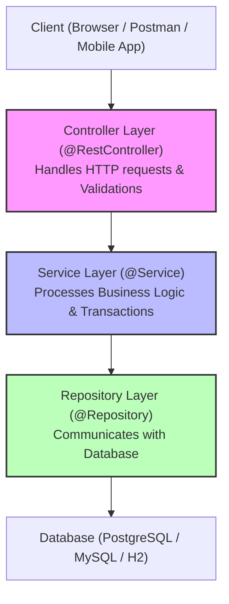

# 🚀 Spring & Spring Boot Master Interview Q&A Guide

Welcome to the ultimate Spring & Spring Boot interview preparation guide. This document contains **35 high-frequency questions** structured logically into key topics, explained in simple, layman terms, backed by concrete code examples and summary answers that are ready to use in your interviews.

---

## 🗺️ Spring Ecosystem Architecture



---

## 📚 Table of Contents
1. [Core Spring & Dependency Injection (DI)](#1-core-spring--dependency-injection-di) (Q1 – Q9)
2. [Spring Boot Foundations](#2-spring-boot-foundations) (Q10 – Q15)
3. [Spring MVC & REST API Design](#3-spring-mvc--rest-api-design) (Q16 – Q22)
4. [Data Access with JPA & Hibernate](#4-data-access-with-jpa--hibernate) (Q23 – Q30)
5. [Advanced Spring Boot (Security, Actuator, DevTools & Testing)](#5-advanced-spring-boot-security-actuator-devtools--testing) (Q31 – Q35)

---

## 1. Core Spring & Dependency Injection (DI)

### Q1: What is Inversion of Control (IoC) and Dependency Injection (DI) in simple terms?
*   **Analogy:** 
    *   **Without IoC:** You want to eat a pizza, so you go to the store, buy tomatoes, flour, cheese, bake it yourself, and wash the dishes. You are in control of the pizza creation.
    *   **With IoC:** You sit on your couch and order pizza from Zomato/UberEats. You do not care *how* the pizza is made or *who* makes it; you just consume it. The control of making the pizza is inverted to the restaurant.
*   **Technical Explanation:** 
    *   **IoC (Inversion of Control):** It is a design principle where the control of object creation, lifecycle, and configuration is shifted from the program code to a container (the Spring IoC container).
    *   **DI (Dependency Injection):** It is the actual design pattern used to implement IoC. Instead of a class instantiating its dependent objects using the `new` keyword, the dependencies are "injected" (provided) by the Spring framework.
*   **Code Example:**
    ```java
    // Old way (No DI)
    public class StudentController {
        private StudentService service = new StudentServiceimple(); // Hardcoded dependency
    }

    // Spring Boot way (With DI)
    @RestController
    public class StudentController {
        private final StudentService service; // Injected by Spring at runtime
        
        public StudentController(StudentService service) {
            this.service = service;
        }
    }
    ```
*   **Interview Answer:** *"Inversion of Control (IoC) is a design principle where the control of managing object lifecycles is handed over to the framework. Dependency Injection (DI) is the implementation of IoC, where Spring automatically supplies the required objects (dependencies) to a class at runtime rather than the class creating them manually."*

---

### Q2: What are the different types of Dependency Injection? Which is best and why?
*   **Explanation:** Spring provides three ways to inject beans:
    1.  **Constructor Injection (Best Practice):** Dependencies are provided through the class constructor.
    2.  **Setter Injection:** Dependencies are provided via public setter methods.
    3.  **Field Injection:** Dependencies are injected directly into class fields using `@Autowired`.
*   **Why Constructor Injection is the best:**
    *   **Immutability:** You can declare your dependencies as `final`. They cannot be modified after initialization.
    *   **No Null Pointer Exceptions:** The compiler ensures you cannot instantiate the class without passing the required dependencies.
    *   **Easy Testing:** You don't need Spring reflection to test the class; you can simply pass mock dependencies in a unit test constructor.
*   **Code Example:**
    ```java
    // Constructor Injection (Recommended)
    @Service
    public class StudentServiceimple implements StudentService {
        private final StudentRepository repository;
        
        public StudentServiceimple(StudentRepository repository) {
            this.repository = repository;
        }
    }
    ```
*   **Interview Answer:** *"The three types of DI are Constructor, Setter, and Field Injection. Constructor injection is the recommended approach because it enforces immutability via final fields, guarantees that all required dependencies are initialized, and simplifies unit testing without requiring a Spring Context."*

---

### Q3: What is a Spring Bean and what are the Bean Scopes?
*   **Explanation:** A **Spring Bean** is a simple Java object that is initialized, configured, and managed by the Spring IoC container. 
*   **Bean Scopes (Where and how long a bean lives):**
    1.  **Singleton (Default):** Only one instance of the bean is created per Spring container. Every request for the bean returns the exact same object.
    2.  **Prototype:** A new instance of the bean is created *every single time* it is requested.
    3.  **Request (Web-only):** A single bean instance is created for every HTTP request.
    4.  **Session (Web-only):** A single bean instance is created for every HTTP Session.
    5.  **Application (Web-only):** Scoped to the lifecycle of the web application.
    6.  **WebSocket (Web-only):** Scoped to a single WebSocket session.
*   **Code Example:**
    ```java
    @Component
    @Scope("prototype") // Changes scope from default Singleton to Prototype
    public class MyStatefulBean { ... }
    ```
*   **Interview Answer:** *"A Spring Bean is a Java object managed by the Spring IoC container. By default, beans have a 'Singleton' scope, meaning only one instance is shared across the entire application. Other scopes include Prototype (new instance every time), Request, Session, Application, and WebSocket."*

---

### Q4: Explain the Spring Bean Lifecycle.
*   **Analogy:** Think of buying a new house: first the structure is built (instantiation), then furniture is moved in (DI), utility connections are made (initialization/aware callbacks), you live in it (usage), and finally, it is demolished when you move out (destruction).
*   **Lifecycle Phases:**
    1.  **Instantiation:** Spring reads bean definitions and creates the Java object.
    2.  **Populate Properties (DI):** Spring injects all dependencies into the class.
    3.  **Aware Methods:** If the bean implements `BeanNameAware` or `ApplicationContextAware`, Spring passes the metadata.
    4.  **BeanPostProcessor (Before Initialization):** Custom hooks run before any initialization.
    5.  **Initialization:** 
        *   Methods annotated with `@PostConstruct` execute.
        *   `InitializingBean.afterPropertiesSet()` runs.
        *   Custom `init-method` runs.
    6.  **BeanPostProcessor (After Initialization):** Custom hooks run after initialization. Bean is ready!
    7.  **Destruction:** When the container shuts down:
        *   Methods annotated with `@PreDestroy` execute.
        *   `DisposableBean.destroy()` runs.
*   **Code Example:**
    ```java
    @Component
    public class DatabaseConnector {
        @PostConstruct
        public void init() {
            System.out.println("Database connection established after properties set.");
        }
        
        @PreDestroy
        public void cleanup() {
            System.out.println("Closing database connection before bean is destroyed.");
        }
    }
    ```
*   **Interview Answer:** *"The Spring Bean lifecycle consists of Instantiation, Dependency Injection, Aware interface execution, Pre-initialization, Initialization (via @PostConstruct), Post-initialization, and finally Destruction (via @PreDestroy) when the application context shuts down."*

---

### Q5: What is the difference between `@Component`, `@Service`, `@Repository`, and `@Controller`?
*   **Explanation:** All of these annotations are **Stereotype Annotations** used to tell Spring: *"Hey, make a bean of this class!"* 
    However, they have different semantic meanings and special built-in behaviors:
    1.  **`@Component`:** The parent annotation. Use this for general-purpose utility beans.
    2.  **`@Controller`:** Used for web controllers that return views (like JSP or Thymeleaf HTML pages).
    3.  **`@RestController`:** A child of `@Controller` + `@ResponseBody`. Returns direct JSON/XML response bodies.
    4.  **`@Service`:** Used for classes that contain core business logic. No special behavior, just semantic meaning.
    5.  **`@Repository`:** Used for classes handling database access. It has a special feature: it automatically catches low-level database exceptions (SQL errors) and translates them into Spring’s standard `DataAccessException`.
*   **Interview Answer:** *"@Component is a generic stereotype annotation for any Spring-managed bean. @Service, @Repository, and @Controller are specialized versions of @Component. @Service represents business logic, @Controller handles web routing, and @Repository handles database access, providing automatic exception translation."*

---

### Q6: What is the difference between `@Component` and `@Bean`?
*   **Explanation:** Both tell Spring to manage a bean, but they are used differently:
    *   **`@Component`:** Class-level annotation. You put it on top of a class file that *you* own and wrote. Spring automatically scans it and instantiates it using reflection.
    *   **`@Bean`:** Method-level annotation. You use it inside a `@Configuration` class to declare a bean. This is useful when you want to register third-party library classes (which you cannot edit to add `@Component` to).
*   **Code Example:**
    ```java
    // You cannot edit the ModelMapper library class, so use @Bean:
    @Configuration
    public class AppConfig {
        @Bean
        public ModelMapper modelMapper() {
            return new ModelMapper(); // You instantiate it manually
        }
    }
    ```
*   **Interview Answer:** *"@Component is applied on class-level and scanned automatically by Spring. @Bean is applied on method-level inside a configuration class, typically used to register third-party library classes that we cannot modify to add @Component."*

---

### Q7: Explain `@Autowired` and how Spring resolves conflicts when multiple beans of the same type exist.
*   **Explanation:** `@Autowired` tells Spring: *"Find a bean matching this variable type and inject it here."*
    If there are multiple beans of the same type, Spring will crash at startup with a `NoUniqueBeanDefinitionException`. You resolve this using:
    1.  **`@Qualifier`:** Explicitly names the bean you want to inject.
    2.  **`@Primary`:** Marks one bean as the default choice when resolving conflicts.
*   **Code Example:**
    ```java
    public interface PaymentGateway { void pay(); }
    
    @Component("upi")
    public class UpiGateway implements PaymentGateway { ... }

    @Component("card")
    @Primary // Default gateway
    public class CardGateway implements PaymentGateway { ... }

    @RestController
    public class OrderController {
        private final PaymentGateway gateway;
        
        // Will inject UpiGateway because of @Qualifier
        public OrderController(@Qualifier("upi") PaymentGateway gateway) {
            this.gateway = gateway;
        }
    }
    ```
*   **Interview Answer:** *"Spring resolves autowiring dependencies by type first. If multiple beans of the same type exist, we can use @Qualifier to specify the target bean by its name, or mark a bean with @Primary to set it as the default choice."*

---

### Q8: What is a Circular Dependency and how do you fix it?
*   **Explanation:** Class A needs Class B to compile, and Class B needs Class A.
    `A -> B -> A`. When Spring starts, it gets stuck in an infinite loop trying to create both, and crashes with a `BeanCurrentlyInCreationException`.
*   **How to fix it:**
    1.  **Redesign (Best):** Refactor code so they do not depend on each other directly. Extract the shared logic to a third Class C.
    2.  **`@Lazy`:** Tell Spring to initialize one of the beans lazily (on-demand instead of startup).
*   **Interview Answer:** *"A circular dependency occurs when Bean A depends on Bean B, and Bean B depends on Bean A. We can resolve this best by refactoring our architecture to remove the tight coupling, or by using the @Lazy annotation on one of the dependency injection points to delay its initialization."*

---

### Q9: What is the Spring ApplicationContext?
*   **Explanation:** The **ApplicationContext** is the brain of your Spring Boot application. It is the container that implements the IoC container. It is responsible for instantiating, configuring, managing, and destroying beans.
*   **Features:**
    *   Bean Factory (instantiating beans)
    *   Internationalization (i18n message sources)
    *   Application event publishing
    *   Resource loading (files/URLs)
*   **Interview Answer:** *"The ApplicationContext is the advanced Spring IoC container. It is responsible for managing the lifecycle of all beans, dependency resolution, event propagation, and loading application configurations."*

---

## 2. Spring Boot Foundations

### Q10: Why do we use Spring Boot instead of standard Spring?
*   **Explanation:** Standard Spring is powerful but requires a massive amount of setup configuration (XML files, configuring databases, setting up Tomcats, manually checking dependency versions). Spring Boot was created to make Spring easy.
*   **Core Pillars of Spring Boot:**
    1.  **Auto-Configuration:** Configures sensible defaults automatically based on classpath libraries.
    2.  **Starter Dependencies (POMs):** Group-related dependencies together (e.g. `spring-boot-starter-web` pulls in Tomcat, Jackson, MVC, Validation).
    3.  **Embedded Servers:** Runs the server (Tomcat/Jetty) inside the runnable jar. You run it like a standard Java app (`java -jar app.jar`).
    4.  **Actuator:** Out-of-the-box health checks and application metrics.
*   **Interview Answer:** *"Spring Boot simplifies Spring development by offering Auto-Configuration, Starter POMs to manage dependency versions, Embedded Tomcat servers, and Actuator for production-ready monitoring, removing the need for boilerplate XML or Java configurations."*

---

### Q11: How does Auto-Configuration work under the hood?
*   **Explanation:** 
    1.  When you run a Spring Boot app, it looks at the `@EnableAutoConfiguration` annotation (inside `@SpringBootApplication`).
    2.  It scans the classpath for auto-configuration JARs (inside `spring-boot-autoconfigure.jar/META-INF/spring.factories`).
    3.  It evaluates **Conditional Annotations** (e.g. `@ConditionalOnClass(DataSource.class)`). If it finds the database driver class and you haven't declared your own connection bean, it automatically configures one.
*   **Interview Answer:** *"Spring Boot Auto-Configuration works using conditional annotations (like @ConditionalOnClass and @ConditionalOnMissingBean). During startup, Spring Boot scans configuration files in the classpath libraries and automatically instantiates beans for which the conditions are met, provided the developer has not defined a custom replacement."*

---

### Q12: Explain the `@SpringBootApplication` annotation.
*   **Explanation:** It is a convenience annotation placed on your main class. It is a bundle of three essential annotations:
    1.  **`@SpringBootConfiguration`:** Marks the class as a configuration source.
    2.  **`@EnableAutoConfiguration`:** Enables Spring Boot’s auto-configuration magic.
    3.  **`@ComponentScan`:** Scans the package of the main class and all sub-packages for `@Component`, `@Service`, `@Repository`, and `@RestController` classes to register them as beans.
*   **Interview Answer:** *"@SpringBootApplication is a bootstrap annotation that combines three key annotations: @SpringBootConfiguration for registering beans, @EnableAutoConfiguration to enable sensible default setups, and @ComponentScan to automatically scan packages for managed components."*

---

### Q13: What are Starter Dependencies (Starter POMs) in Spring Boot?
*   **Explanation:** Starters are like recipe bundles. If you want to build a Web API, you don't need to find 15 different library versions. You just add `spring-boot-starter-web`. Spring Boot imports a compatible, pre-tested group of libraries for you.
*   **Examples:**
    *   `spring-boot-starter-data-jpa`: Imports Hibernate, JDBC, and JPA dependencies.
    *   `spring-boot-starter-security`: Imports Spring Security.
    *   `spring-boot-starter-validation`: Imports Hibernate Validator for request checking.
*   **Interview Answer:** *"Starter dependencies are convenient dependency descriptors that group related libraries together. They allow developers to import a bundle of pre-tested dependencies with compatible versions in a single step, reducing maven dependency conflicts."*

---

### Q14: How do you configure and use Profiles in Spring Boot?
*   **Explanation:** You want different settings for Local Development (using H2 in-memory DB) and Production (using a secure PostgreSQL database). **Profiles** solve this.
*   **Usage:**
    1.  Create files like `application-dev.properties` and `application-prod.properties`.
    2.  Activate a profile in `application.properties` using: `spring.profiles.active=dev` (or pass it as a command-line flag during run).
    3.  Use `@Profile("prod")` to run specific code or load specific beans only in production.
*   **Code Example:**
    ```java
    @Component
    @Profile("dev") // This class only runs during development
    public class MockEmailService implements EmailService { ... }
    ```
*   **Interview Answer:** *"Profiles allow us to segregate application configuration for different environments like Dev, QA, or Prod. We activate them using the spring.profiles.active property, and can conditionally register beans using the @Profile annotation."*

---

### Q15: What is the difference between `application.properties` and `application.yml`?
*   **Explanation:** Both are configuration files used by Spring Boot.
    *   **Properties (.properties):** Uses flat, key-value syntax. Can have repetitive keys.
    *   **YAML (.yml):** Uses hierarchical, tree-like structure with indentation. It is cleaner, supports maps/lists easily, and eliminates key duplication.
*   **Comparison:**
    ```properties
    # Properties
    server.port=8080
    server.servlet.context-path=/api
    ```
    ```yaml
    # YAML equivalent
    server:
      port: 8080
      servlet:
        context-path: /api
    ```
*   **Interview Answer:** *"Both files serve the same configuration purpose. application.properties uses flat key-value pairs, while application.yml uses a hierarchical, indented structure which is more readable and reduces duplication for nested configurations."*

---

## 3. Spring MVC & REST API Design

### Q16: What is the difference between `@Controller` and `@RestController`?
*   **Explanation:**
    *   **`@Controller`:** Used for traditional Web Pages (MVC). Methods return a `String` which points to a template (HTML/JSP). To return raw JSON, you must add `@ResponseBody` to every method.
    *   **`@RestController`:** Used for REST APIs. It is a combination of `@Controller` and `@ResponseBody`. Every method automatically returns its data serialized into JSON/XML directly to the client.
*   **Interview Answer:** *"@Controller is used for traditional MVC applications returning web views, whereas @RestController is a convenience annotation combining @Controller and @ResponseBody, specifically designed for RESTful APIs where responses are written directly into the HTTP response body as JSON."*

---

### Q17: What is `ResponseEntity` and why should you use it?
*   **Explanation:** When returning data from an API, you don't just want to return the body. You also want control over:
    1.  **HTTP Status Codes** (e.g., 200 OK, 201 Created, 400 Bad Request, 404 Not Found).
    2.  **HTTP Headers** (e.g. Custom Cache headers, Content-Type).
    `ResponseEntity` is a wrapper class that lets you configure all of these dynamically.
*   **Code Example:**
    ```java
    @GetMapping("/{id}")
    public ResponseEntity<StudentDto> getStudent(@PathVariable Long id) {
        StudentDto student = service.getStudentById(id);
        return ResponseEntity
                .status(HttpStatus.OK)
                .header("Custom-Header", "Value")
                .body(student);
    }
    ```
*   **Interview Answer:** *"ResponseEntity represents the entire HTTP response, including the status code, headers, and response body. We use it in REST controllers to dynamically control API HTTP responses based on business conditions."*

---

### Q18: Difference between `@PathVariable` and `@RequestParam`.
*   **Explanation:**
    *   **`@PathVariable`:** Extracts values directly from the URI path. Used for identifying a specific resource.
        *   *Example URL:* `/api/student/5` (Checks for student with ID 5)
    *   **`@RequestParam`:** Extracts query parameters after the `?` character in the URL. Used for filtering, sorting, or paginating data.
        *   *Example URL:* `/api/student?sortBy=name&page=0`
*   **Code Example:**
    ```java
    @GetMapping("/{id}") // PathVariable
    public Student getStudent(@PathVariable Long id) { ... }

    @GetMapping // RequestParam
    public List<Student> searchStudents(@RequestParam String name) { ... }
    ```
*   **Interview Answer:** *"@PathVariable is used to extract values directly from the URI path to identify a specific resource. @RequestParam is used to extract query parameters from the request URL, typically used for filtering, sorting, or pagination."*

---

### Q19: How do you validate requests in Spring Boot?
*   **Explanation:** You must validate input data before processing it (e.g., email format must be valid, name must not be blank).
    1.  Import `spring-boot-starter-validation`.
    2.  Apply validation annotations on the DTO fields (`@NotBlank`, `@Email`, `@Size`, `@Min`, `@Max`).
    3.  Add the `@Valid` annotation next to the `@RequestBody` inside the Controller method.
*   **Code Example:**
    ```java
    // 1. Declare validation rules in DTO
    public class AddStudentRequest {
        @NotBlank(message = "Name cannot be empty")
        @Size(min = 3, message = "Name must be at least 3 characters")
        private String name;
    }

    // 2. Trigger validation in Controller
    @PostMapping("/")
    public ResponseEntity<Student> create(@Valid @RequestBody AddStudentRequest dto) { ... }
    ```
*   **Interview Answer:** *"We validate requests by adding Jakarta validation annotations like @NotBlank or @Email on the properties of our DTO, and then placing the @Valid annotation on the request body parameter in our controller method. This throws a MethodArgumentNotValidException if validation checks fail."*

---

### Q20: How do you handle exceptions globally in Spring Boot?
*   **Explanation:** Instead of writing `try-catch` blocks in every single Controller method, you can create a single centralized class that catches all exceptions thrown in the application and returns uniform JSON error responses.
    *   **`@RestControllerAdvice`:** Defines a global interceptor class.
    *   **`@ExceptionHandler`:** Catches a specific exception type and defines the custom error response.
*   **Code Example:**
    ```java
    @RestControllerAdvice
    public class GlobalExceptionHandler {
        
        @ExceptionHandler(IllegalArgumentException.class)
        public ResponseEntity<String> handleNotFound(IllegalArgumentException ex) {
            return ResponseEntity.status(HttpStatus.NOT_FOUND).body(ex.getMessage());
        }
    }
    ```
*   **Interview Answer:** *"We handle exceptions globally using @RestControllerAdvice and @ExceptionHandler annotations. This intercepts exceptions thrown anywhere in our controllers and handles them in a single place to return a clean, unified error response."*

---

### Q21: What are standard HTTP status codes and when are they used?
*   **Explanation:** HTTP status codes tell the client the outcome of their API request.
    *   **`200 OK`:** Successful GET, PUT, or PATCH requests.
    *   **`201 Created`:** Successful POST request (resource successfully created).
    *   **`204 No Content`:** Successful DELETE request (no body returned).
    *   **`400 Bad Request`:** Client sent invalid input (e.g., validation failure).
    *   **`401 Unauthorized`:** Client is not authenticated (missing token).
    *   **`403 Forbidden`:** Client is authenticated but lacks access rights (roles).
    *   **`404 Not Found`:** Requested resource does not exist.
    *   **`500 Internal Server Error`:** Server crashed due to a bug.
*   **Interview Answer:** *"Standard HTTP status codes indicate request outcomes: 200 series for success (200 OK, 201 Created, 204 No Content), 400 series for client errors (400 Bad Request, 401 Unauthorized, 404 Not Found), and 500 series for server-side errors."*

---

### Q22: What is the difference between HTTP `PUT` and `PATCH` methods?
*   **Explanation:**
    *   **`PUT`:** Updates the **entire** resource. The client must send all fields of the object. If a field is missing, it is replaced with `null` or default values in the database.
    *   **`PATCH`:** Performs a **partial** update. The client only sends the fields they want to change (e.g. only updating the email).
*   **Interview Answer:** *"PUT is used for full resource updates, where the client sends the complete updated object. PATCH is used for partial updates, modifying only the specific fields provided in the request payload."*

---

## 4. Data Access with JPA & Hibernate

### Q23: What is the difference between JPA and Hibernate?
*   **Analogy:** 
    *   **JPA** is like the **rules/laws of road traffic** (a written book of rules/standards).
    *   **Hibernate** is a **car driving on the road** (the real machine implementing those rules).
*   **Technical Explanation:** 
    *   **JPA (Jakarta Persistence API):** A specification (interface standard) defined by Java. It only provides annotations and guidelines, no actual execution code.
    *   **Hibernate:** An ORM (Object-Relational Mapping) framework that *implements* the JPA specifications. It writes and runs the actual SQL queries behind the scenes.
*   **Interview Answer:** *"JPA is a specification that defines standards for ORM operations in Java, while Hibernate is a framework that implements the JPA specification, executing the actual database operations."*

---

### Q24: What is Spring Data JPA?
*   **Explanation:** Writing database repository queries manually (writing Connection Pools, EntityManagers, opening/closing connections) is tedious. **Spring Data JPA** provides an abstraction layer on top of Hibernate. You simply write an interface that extends `JpaRepository` and get CRUD operations automatically.
*   **Key Feature (Query Methods):** It parses method names into SQL queries.
    *   `findByEmail(String email)` is automatically translated into `SELECT * FROM student WHERE email = ?`.
*   **Interview Answer:** *"Spring Data JPA is a library that provides a high-level abstraction on top of JPA/Hibernate. It eliminates boilerplate code by generating repository implementations at runtime based on interface methods."*

---

### Q25: Explain the different Entity Relationships in JPA.
*   **Explanation:** How tables relate to each other:
    1.  **`@OneToOne`:** One Student has one Student Profile.
    2.  **`@ManyToOne`:** Many Students belong to one Department.
    3.  **`@OneToMany`:** One Teacher has many Classrooms.
    4.  **`@ManyToMany`:** Many Students enroll in many Courses. Requires a Join Table.
*   **Code Example:**
    ```java
    @Entity
    public class Student {
        @Id @GeneratedValue(strategy = GenerationType.IDENTITY)
        private Long id;

        @ManyToOne
        @JoinColumn(name = "department_id") // Creates foreign key column
        private Department department;
    }
    ```
*   **Interview Answer:** *"JPA supports four types of relationships: One-to-One, One-to-Many, Many-to-One, and Many-to-Many. These are mapped using annotations and managed through foreign keys or joint tables."*

---

### Q26: What does `@Transactional` do under the hood?
*   **Analogy (Bank Transfer):** You want to transfer Rs 1000 to a friend. 
    1. Deduct Rs 1000 from your account. 
    2. Add Rs 1000 to your friend's account.
    If Step 1 succeeds but Step 2 fails (e.g. system crash), you lose money. `@Transactional` ensures that either *both* steps succeed, or *both* are cancelled (rolled back).
*   **How it works:** Spring creates a **Proxy** around the annotated method. It starts a database transaction before entering the method. If the method runs successfully, it commits. If a `RuntimeException` occurs, it automatically rolls back all changes.
*   **Interview Answer:** *"@Transactional manages database transactions. It uses dynamic proxies to intercept method calls: starting a transaction before method execution, committing it on success, and rolling it back if a RuntimeException is thrown."*

---

### Q27: Difference between Lazy Loading and Eager Loading.
*   **Explanation:**
    *   **Eager Loading (`FetchType.EAGER`):** Loads the main entity AND all its related entities at the same time. (e.g., fetching a Student immediately fetches all their 50 past course enrollment histories, even if you don't need them).
    *   **Lazy Loading (`FetchType.LAZY`):** Loads the related entities *only when you explicitly ask for them* (e.g., when calling `student.getCourses()`). This saves database memory.
*   **Interview Answer:** *"Eager loading fetches the target entity and its related associations simultaneously from the database. Lazy loading loads related entities on-demand when their getter methods are called, which is the recommended default for performance."*

---

### Q28: What is the N+1 SELECT Problem and how do you solve it?
*   **Explanation:** Occurs when fetching a list of $N$ entities that have a lazy relationship, and you access that relationship for each entity.
    *   *Example:* You fetch all 100 students: `SELECT * FROM student` (1 Query).
    *   Next, you loop through each student and print their department name: `student.getDepartment().getName()`.
    *   Hibernate runs an additional database query for *each* student to get their department: (100 Queries).
    *   Total queries run: $1 + 100 = 101$ queries. This destroys database performance.
*   **Solutions:**
    1.  **Fetch Join (JPQL):** Loads both parent and child in a single query.
    2.  **`@EntityGraph`:** Instructs Spring Data JPA to perform eager fetching on specific fields during query execution.
*   **Code Example:**
    ```java
    // Solve with JOIN FETCH
    @Query("SELECT s FROM Student s JOIN FETCH s.department")
    List<Student> findAllStudentsWithDepartments();
    ```
*   **Interview Answer:** *"The N+1 problem occurs when fetching an entity with lazy relationships; JPA runs 1 query to fetch the parent records and N additional queries to fetch their children. We resolve this by using JOIN FETCH in JPQL or by applying @EntityGraph."*

---

### Q29: What is First Level Cache vs Second Level Cache in Hibernate?
*   **Explanation:**
    *   **First Level Cache:** Associated with the `Session` (Transaction) scope. It is enabled by default. If you query the same entity twice inside the same transaction, Hibernate retrieves it from memory instead of querying the database again.
    *   **Second Level Cache:** Associated with the `SessionFactory` (Application) scope. It is disabled by default. It allows caching entities across different transactions and users. You must configure a provider like Ehcache or Redis.
*   **Interview Answer:** *"First level cache is transaction-scoped, enabled by default, and caches data within a single Hibernate session. Second level cache is application-scoped, disabled by default, and requires external configuration to share cached data across multiple sessions."*

---

### Q30: What is the difference between `save()`, `saveAndFlush()`, and `persist()`?
*   **Explanation:**
    *   **`persist()`:** A JPA method. It registers a new entity state but does *not* write it to the database immediately. It doesn't return anything.
    *   **`save()`:** A Spring Data JPA wrapper. It returns the saved entity. If the entity is new, it calls persist; if it already exists, it calls `merge()`. The changes are stored in memory and flushed to the database at commit time.
    *   **`saveAndFlush()`:** Saves changes and *immediately* forces Hibernate to write (flush) SQL changes to the database table.
*   **Interview Answer:** *"save() writes changes to the database lazily at transaction commit time and returns the entity. saveAndFlush() forces Hibernate to write changes to the DB immediately. persist() is a standard JPA method used to make a transient object persistent."*

---

## 5. Advanced Spring Boot (Security, Actuator, DevTools & Testing)

### Q31: How does the Spring Security filter chain work?
*   **Explanation:** Spring Security is based on Servlet **Filters**. A request must pass through a chain of filters before reaching your `@RestController`:
    1.  `SecurityContextPersistenceFilter`: Sets up the security context.
    2.  `UsernamePasswordAuthenticationFilter` (or custom JWT filter): Extracts credentials and attempts authentication.
    3.  `ExceptionTranslationFilter`: Catches security exceptions (e.g., converts them to 401 or 403 responses).
    4.  `FilterSecurityInterceptor`: Checks if the user has correct roles (authorization).
*   **Interview Answer:** *"Spring Security acts as a chain of servlet filters that intercept requests. These filters extract credentials, authenticate users via an AuthenticationManager, store successful logins in the SecurityContextHolder, and authorize request access based on roles."*

---

### Q32: What is JWT and how is it used in Spring Boot APIs?
*   **Explanation:** **JWT (JSON Web Token)** is a compact, URL-safe token representing claims between two parties.
    *   **Why use it:** Traditional web apps store session state on the server. For REST APIs, we want **statelessness** (horizontal scaling). 
    *   **Flow:**
        1. User logins via `POST /login` with password.
        2. Server validates password and returns a signed JWT.
        3. For all future requests, client attaches `Authorization: Bearer <token>` header.
        4. Spring Security intercepts the token, decodes/verifies it, and authenticates the request without database hits.
*   **Interview Answer:** *"JWT is a signed token used for stateless authentication. In Spring Boot, we create a filter that intercepts incoming requests, validates the signature of the JWT from the Authorization header, and sets the authenticated user in the SecurityContext."*

---

### Q33: What is Spring Boot Actuator?
*   **Explanation:** When your application is deployed to production, you need to know if it is running correctly. Actuator exposes HTTP endpoints to monitor app health.
*   **Core Endpoints:**
    *   `/actuator/health`: Checks if database, disk, and application are healthy.
    *   `/actuator/metrics`: Shows JVM memory, CPU usage, active threads.
    *   `/actuator/env`: Displays environment properties.
    *   `/actuator/loggers`: View and change log levels (e.g., changing INFO to DEBUG) on the fly without restarting.
*   **Interview Answer:** *"Spring Boot Actuator provides production-ready monitoring capabilities. It exposes HTTP endpoints to monitor health, JVM metrics, configuration environments, and check log configurations at runtime."*

---

### Q34: What is Spring Boot DevTools?
*   **Explanation:** During development, you don't want to manually rebuild your project and restart Tomcat every time you change a line of code.
    *   **Features:**
        *   **Automatic Restart:** Automatically restarts the application whenever files on the classpath change.
        *   **LiveReload:** Refreshes the browser automatically when static resources change.
        *   **Properties Override:** Disables caching (like template caching) so changes show up instantly.
*   **Interview Answer:** *"Spring Boot DevTools is a development-only tool dependency that speeds up development cycles by providing automatic restarts when classpath code changes, browser live-reloading, and disabling resource caches."*

---

### Q35: What is the difference between `@SpringBootTest` and `@WebMvcTest`?
*   **Explanation:**
    *   **`@SpringBootTest`:** A full integration test. It boots up the entire Spring Context, connects to the database, and loads all beans. It is thorough but slow.
    *   **`@WebMvcTest`:** A sliced unit test. It only boots up the web layer (Controllers, filters, mappings). It does not load Services, Repositories, or databases. You mock them using `@MockBean` (or `@MockitoBean` in Spring Boot 3.4+). It is very fast.
*   **Code Example:**
    ```java
    @WebMvcTest(StudentController.class)
    public class StudentControllerTest {
        @Autowired
        private MockMvc mockMvc; // Simulates HTTP requests

        @MockBean
        private StudentService service; // Mock service dependency
    }
    ```
*   **Interview Answer:** *"@SpringBootTest loads the complete application context for full integration testing. @WebMvcTest is a sliced test that only loads the web controller layer, allowing us to test endpoints quickly using MockMvc while mocking backend service beans."*
